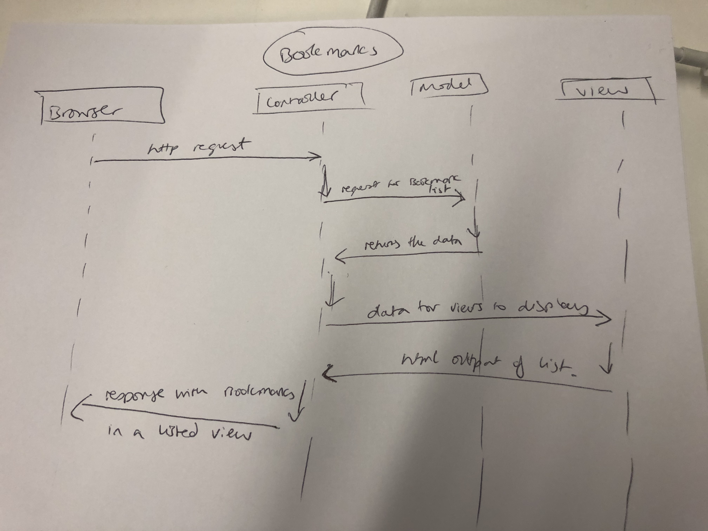

User story created:

As a user so that I can see what bookmarks I have, I would like to see a list of bookmarks.

As a time-pressed user
So that I can save a website
I would like to add the site's address and title to bookmark manager

Database setup instructions:
`brew install postgresql`
launched psql
created a new database as there was a 'FATAL' error with my named database. The new database has my username as its name
  `CREATE DATABASE marjanmagharehi;`
Created a new postgresql database for Bookmark Manager called bookmark_manager:
  `CREATE DATABASE bookmark_manager;`
Created a new table within that database:
  `CREATE TABLE bookmarks (id SERIAL PRIMARY KEY, url VARCHAR(60))`
    - this is also documented in the migrations folder, within the database(db) folder.
Used \dt to view the database in terminal to make sure the table had been made
